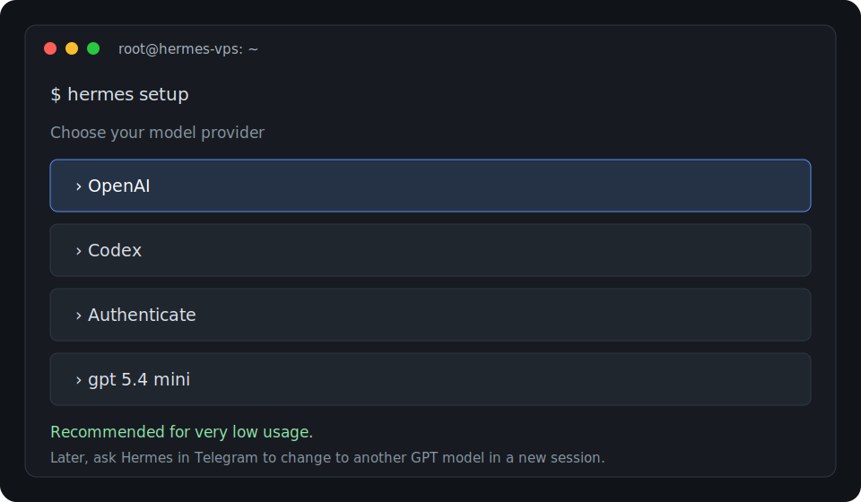

# 04. Install Hermes Agent

This section follows the Hermes Agent VPS guide after the Hetzner VPS is ready.

Source guide:

```text
https://www.reddit.com/r/hermesagent/comments/1t2raft/complete_guide_how_to_host_hermes_agent_on_a/
```

## 1. Run the Installer

```bash
curl -fsSL https://raw.githubusercontent.com/NousResearch/hermes-agent/main/scripts/install.sh | bash
```

## 2. Reload the Shell

```bash
source ~/.bashrc
```

If `hermes` is still not found, close the SSH session and reconnect:

```bash
exit
ssh root@<your-server-ip>
```

## 3. Verify the Install

```bash
hermes --version
```

```bash
hermes doctor
```

## 4. Run Hermes Setup

```bash
hermes setup
```

When the setup wizard asks you to choose a model, use this path:

```text
OpenAI -> Codex -> Authenticate -> gpt 5.4 mini
```



Select:

```text
gpt 5.4 mini
```

This is good for very low usage.

Later, you can tell Hermes directly in Telegram to change the model to another GPT model in a new session.

Continue through the setup prompts and finish authentication.

## 5. Set Approval Mode

For a VPS setup, use ask mode:

```bash
hermes config set approval_mode ask
```

Next: [Set up Telegram and Gateway](05-telegram-and-gateway.md)
